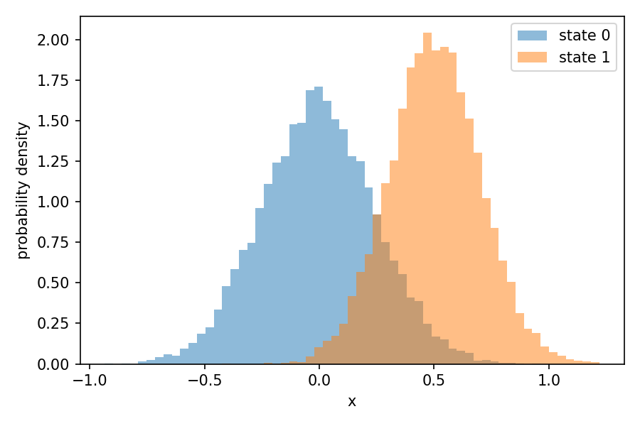
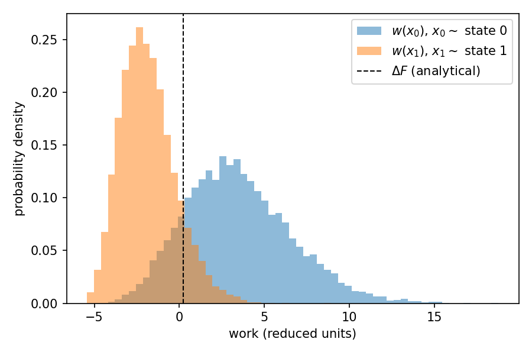
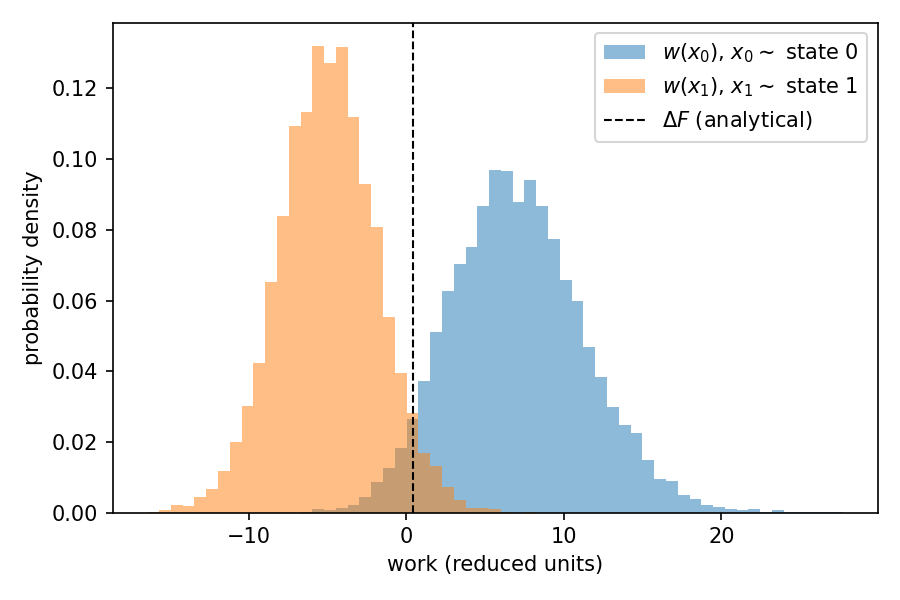

# BayesBAR for two harmonic oscillators

In this example, we use BayesBAR to compute the free energy difference between
**two** harmonic oscillators that have different force constants and different
equilibrium positions.
BayesBAR is the Bayesian Bennett acceptance ratio method, the two-state special
case of BayesMBAR, and is the natural choice when there are only two states.
Because the potential energy is quadratic, the free energy difference can be
computed analytically, which lets us validate the result returned by BayesBAR.

We work through two cases: first a pair of one-dimensional oscillators, where the
configuration space overlap can be visualized directly, and then a pair of
four-dimensional oscillators, where it cannot and we rely on the work projection
instead.

In both cases we follow three steps:

1. Draw samples from the Boltzmann distribution of each state.
2. Compute the reduced potential energy of every sample in both states and
   collect them into a $2 \times N$ matrix used as input to BayesBAR.
3. Run BayesBAR and compare its result to the analytical value.


```python
import numpy as np
import matplotlib.pyplot as plt
from bayesmbar import BayesBAR
```

## 1. Two 1D harmonic oscillators

The reduced potential energy of a one-dimensional harmonic oscillator is

$$u(x) = \tfrac{1}{2} k (x - \mu)^2,$$

where $k$ is the force constant and $\mu$ is the equilibrium position.
Its free energy (up to an additive constant) is $F = -\tfrac{1}{2}\ln(2\pi/k)$,
so the free energy difference between two oscillators depends only on their
force constants,

$$\Delta F = F_2 - F_1 = \tfrac{1}{2}\ln\!\left(\frac{k_2}{k_1}\right),$$

and is independent of the equilibrium positions.

Define the two oscillators and compute the analytical free energy difference.


```python
mu = np.array([0.0, 0.5])    ## equilibrium positions
k = np.array([16.0, 25.0])   ## force constants

analytical_dF = 0.5 * np.log(k[1] / k[0])
print("analytical DeltaF = 0.5 * ln(k2 / k1) =", analytical_dF)
```

```text
analytical DeltaF = 0.5 * ln(k2 / k1) = 0.22314355131420976
```


Draw samples from the Boltzmann distribution of each state and compute the
reduced potential energies of all samples in both states.
Note that the two equilibrium positions are kept close enough that the two
states share configurations; without this overlap BAR cannot bridge the states.


```python
n = 10000
sigma = np.sqrt(1.0 / k)

np.random.seed(0)
x = [np.random.normal(mu[i], sigma[i], (n,)) for i in range(2)]
x = np.concatenate(x)

u = 0.5 * k.reshape((-1, 1)) * (x - mu.reshape((-1, 1))) ** 2
num_conf = np.array([n, n])
```

The energy matrix `u` has shape `(2, 2 * n)`: row `i` holds the reduced
potential energy of every sample evaluated in state `i`.

### Checking the configuration space overlap

BAR can only bridge the two states if their configuration spaces overlap.
Because $x$ is one-dimensional here, we can visualize this overlap directly by
plotting the probability distributions of the configurations sampled from each
state.


```python
x0, x1 = x[:n], x[n:]
bins = np.linspace(x.min(), x.max(), 60)
plt.hist(x0, bins=bins, density=True, alpha=0.5, label="state 0")
plt.hist(x1, bins=bins, density=True, alpha=0.5, label="state 1")
plt.xlabel("x")
plt.ylabel("probability density")
plt.legend()
plt.show()
```



The two distributions clearly overlap, so the two states share configurations
and BAR can bridge them.

Visualizing the overlap directly is only possible because $x$ is
one-dimensional. When $x$ is high-dimensional, plotting the distribution of the
configurations is no longer feasible (see the
[four-dimensional case](#2-two-4d-harmonic-oscillators) below).
However, we can always project the configurations onto the **work** required to
switch a configuration between the two states,

$$w(x) = u_1(x) - u_0(x),$$

which is one-dimensional regardless of the dimensionality of $x$.
We then plot the distribution of $w$ evaluated on the samples from each state,
$w(x_0)$ with $x_0 \sim p_0$ and $w(x_1)$ with $x_1 \sim p_1$.


```python
w0 = u[1, :n] - u[0, :n]    ## w(x) for samples from state 0
w1 = u[1, n:] - u[0, n:]    ## w(x) for samples from state 1
```

The two distributions overlap in this projected, one-dimensional space. By the
Crooks fluctuation theorem they cross at $\Delta F$, and the size of the region
where they overlap reflects the configuration space overlap of the two states:
more overlap means a more reliable free energy estimate.


```python
bins = np.linspace(min(w0.min(), w1.min()), max(w0.max(), w1.max()), 60)
plt.hist(w0, bins=bins, density=True, alpha=0.5, label=r"$w(x_0)$, $x_0 \sim$ state 0")
plt.hist(w1, bins=bins, density=True, alpha=0.5, label=r"$w(x_1)$, $x_1 \sim$ state 1")
plt.axvline(analytical_dF, color="k", ls="--", lw=1, label=r"$\Delta F$ (analytical)")
plt.xlabel("work (reduced units)")
plt.ylabel("probability density")
plt.legend()
plt.show()
```



The two work distributions overlap around $\Delta F$, consistent with the
overlap we saw in the configuration distributions.

### Running BayesBAR

Run BayesBAR to compute the free energy difference between the two states.


```python
bar = BayesBAR(u, num_conf, sample_size=1000, verbose=False)
```

Compare the free energy difference from BayesBAR with the analytical reference.
BayesBAR reports the posterior mode and mean as estimates of the free energy
difference, and the posterior standard deviation as its uncertainty.
The estimate agrees with the analytical value $\Delta F \approx 0.223$ within
the reported uncertainty.


```python
np.set_printoptions(precision=3)

print("analytical DeltaF :", analytical_dF)
print("posterior mode    :", bar.dF_mode)
print("posterior mean    :", bar.dF_mean)
print("posterior std     :", bar.dF_std)
```

```text
analytical DeltaF : 0.22314355131420976
posterior mode    : [0.24]
posterior mean    : 0.24024236854158337
posterior std     : 0.023093738408070375
```

## 2. Two 4D harmonic oscillators

We now repeat the calculation for two **four-dimensional** harmonic oscillators.
This illustrates the case where the configuration space is high-dimensional and
cannot be visualized directly.

The reduced potential energy of a $d$-dimensional harmonic oscillator is

$$u(\mathbf{x}) = \tfrac{1}{2} \sum_{i=1}^{d} k_i (x_i - \mu_i)^2,$$

where $k_i$ is the force constant and $\mu_i$ is the equilibrium position along
dimension $i$.
Its free energy (up to an additive constant) is
$F = -\tfrac{1}{2}\sum_i \ln(2\pi/k_i)$, so the free energy difference between two
oscillators is

$$\Delta F = F_2 - F_1 = \tfrac{1}{2}\sum_{i=1}^{d}
  \ln\!\left(\frac{k_{2,i}}{k_{1,i}}\right).$$

Define the two four-dimensional oscillators. Each state has its own force
constant and equilibrium position along each of the four dimensions.


```python
d = 4
mu = np.array([[0.0, 0.0, 0.0, 0.0],
               [0.5, 0.3, 0.4, 0.2]])      ## equilibrium positions, shape (2, d)
k = np.array([[16.0, 20.0, 25.0, 18.0],
              [25.0, 30.0, 20.0, 22.0]])   ## force constants, shape (2, d)

analytical_dF = 0.5 * np.sum(np.log(k[1] / k[0]))
print("analytical DeltaF =", analytical_dF)
```

```text
analytical DeltaF = 0.4146396774422627
```


Draw samples and compute the reduced potential energies, exactly as before but
now with four-dimensional configurations.


```python
n = 10000
sigma = np.sqrt(1.0 / k)                    ## shape (2, d)

np.random.seed(0)
x = [np.random.normal(mu[i], sigma[i], (n, d)) for i in range(2)]
x = np.concatenate(x)                       ## shape (2 * n, d)

u = 0.5 * np.sum(
    k[:, None, :] * (x[None, :, :] - mu[:, None, :]) ** 2, axis=2
)
num_conf = np.array([n, n])
```

### Checking the configuration space overlap

Since $\mathbf{x}$ is now four-dimensional, we cannot plot the distribution of
the configurations directly. Plotting the marginal distribution of each
coordinate does not help either, because overlap of the marginals does not
guarantee overlap of the full joint distribution.
Instead, we rely on the **work** projection $w(\mathbf{x}) = u_1(\mathbf{x}) -
u_0(\mathbf{x})$, which is one-dimensional regardless of the dimensionality of
$\mathbf{x}$, and plot the distribution of $w$ evaluated on the samples from
each state.


```python
w0 = u[1, :n] - u[0, :n]    ## w(x) for samples from state 0
w1 = u[1, n:] - u[0, n:]    ## w(x) for samples from state 1

bins = np.linspace(min(w0.min(), w1.min()), max(w0.max(), w1.max()), 60)
plt.hist(w0, bins=bins, density=True, alpha=0.5, label=r"$w(x_0)$, $x_0 \sim$ state 0")
plt.hist(w1, bins=bins, density=True, alpha=0.5, label=r"$w(x_1)$, $x_1 \sim$ state 1")
plt.axvline(analytical_dF, color="k", ls="--", lw=1, label=r"$\Delta F$ (analytical)")
plt.xlabel("work (reduced units)")
plt.ylabel("probability density")
plt.legend()
plt.show()
```



The two work distributions overlap around $\Delta F$, confirming that the two
states share enough configurations for BAR to bridge them.

### Running BayesBAR

Run BayesBAR and compare its result with the analytical value
$\Delta F \approx 0.415$.


```python
bar = BayesBAR(u, num_conf, sample_size=1000, verbose=False)

np.set_printoptions(precision=3)
print("analytical DeltaF :", analytical_dF)
print("posterior mode    :", bar.dF_mode)
print("posterior mean    :", bar.dF_mean)
print("posterior std     :", bar.dF_std)
```

```text
analytical DeltaF : 0.4146396774422627
posterior mode    : [0.423]
posterior mean    : 0.4234967041999666
posterior std     : 0.03894080614936193
```
