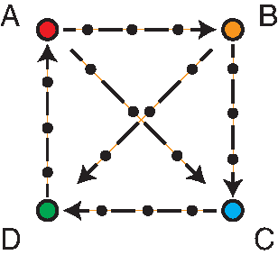

# CBayesMBAR for harmonic oscillators
In this example, we will compute the free energy differences among four harmonic oscillators using a
perturbation graph with cycles. We will use CBayesMBAR to compute the free energy differences, which
takes into account constraints on the free energy differences imposed by the cycles in the 
perturbation graph.


```python
from bayesmbar import CBayesMBAR
import numpy as np
```

### 1. Setup of the four harmonic oscillators and the perturbation graph
The four 2-d harmonic oscillators, labeled as A, B, C, and D, are defined by quadratic potentials of
$U_i(x) = 1/2 \cdot k_i ||x - \mu_i||^2$, where $k_i$ is the force constant, $\mu_i$ is the 
equilibrium position, $i$ is the oscillator index, and $x$ is the position of the oscillator. 
Both $\mu_i$ and $x$ are 2-d vectors.

The perturbation graph is shown below. The nodes represent the four harmonic oscillators, and the
edges represent the perturbation paths between the oscillators. The
small black circles on each path represent intermediate states between two oscillators.
Each intermediate state is also a harmonic oscillator, whose force constant and equilibrium position
are linearly interpolated from the two end states. 




```python
ka, kb, kc, kd = 4, 9, 16, 25
## equilibrium positions of three two-dimensional harmonic oscillators
mu = {
    "a": np.array([-1.0, 1.0]),
    "b": np.array([1.0, 1.0]),
    "c": np.array([1.0, -1.0]),
    "d": np.array([-1.0, -1.0]),
}

## spring constants
k = {
    "a": np.ones(2) * ka,
    "b": np.ones(2) * kb,
    "c": np.ones(2) * kc,
    "d": np.ones(2) * kd,
}

## interpolate the equilibrium positions and spring constants between pairs of states
pairs = [("a", "b"), ("b", "c"), ("c", "d"), ("d", "a"), ("a", "c"), ("b", "d")]
for s1, s2 in pairs:
    for idx in range(1, 4):
        mu[(s1, s2, idx)] = mu[s1] + (mu[s2] - mu[s1]) / 4 * idx
        k[(s1, s2, idx)] = k[s1] + (k[s2] - k[s1]) / 4 * idx

```

### 2. Sample configurations from states on perturbation paths
Sample configurations from all states including both end states and intermediate states. Because 
each state is a harmonic oscillator, we can sample configurations from each state by sampling from 
a 2-d normal distribution with mean $\mu_i$ and covariance matrix $\Sigma_i = \sqrt{1/k_i} \cdot I$.


```python
def k_to_sigma(k):
    return np.sqrt(1.0 / k)

n = 2000
np.random.seed(0)
x = {}
for s in mu.keys():
    x[s] = np.random.normal(mu[s], k_to_sigma(k[s]), (n, 2))
```

### 3. Prepare input for CBayesMBAR
Because CBayesMBAR couples multiple MBAR calculations, it requires a list of MBAR inputs. Each MBAR
input includes an energy matrix, and a list of numbers of samples from each state in that MBAR.
Therefore, the input for CBayesMBAR is a list of energy matrices and a list of lists of numbers of
samples. In addition, CBayesMBAR requires information about identical states.


```python
u_list = []
for s1, s2 in pairs:
    key = [s1] + [(s1, s2, idx) for idx in range(1, 4)] + [s2]
    xs = np.concatenate([x[s] for s in key])
    u = np.stack(
        [np.sum(0.5 * k[s] * (xs - mu[s]) ** 2, axis=1) for s in key], axis=0
    )
    u_list.append(u)

num_conf_list = [
    [u.shape[1] // u.shape[0] for i in range(u.shape[0])] for u in u_list
]
identical_states = (
    [(0, 0), (3, 4), (4, 0)],
    [(0, 4), (1, 0), (5, 0)],
    [(1, 4), (2, 0), (4, 4)],
    [(2, 4), (3, 0), (5, 4)],
)
```

### 4. Compute free energy differences using CBayesMBAR


```python
cbmbar = CBayesMBAR(
    u_list, num_conf_list, identical_states, random_seed=0
)

## compute the free energy difference between end states of each perturbation path
deltaF_cbmbar = {}
for i in range(len(pairs)):
    s1, s2 = pairs[i]
    deltaF_cbmbar[(s1, s2)] = cbmbar.DeltaF_mode[i][0, -1].item()
```

```text
Solve for the mode of the likelihood
==================================================================
                RUNNING THE NEWTON'S METHOD                     

                           * * *                                

                    Tolerance EPS = 1.00000E-10                  

At iterate    0; f= 7.21168E+00; |1/2*Newton_decrement^2|: 1.22139E-02

At iterate    1; f= 7.19882E+00; |1/2*Newton_decrement^2|: 1.12662E-04

At iterate    2; f= 7.19870E+00; |1/2*Newton_decrement^2|: 2.45339E-08

At iterate    3; f= 7.19870E+00; |1/2*Newton_decrement^2|: 1.46859E-15

N_iter   = total number of iterations
N_func   = total number of function and gradient evaluations
F        = final function value 

             * * *     

N_iter    N_func        F
     4         7    7.198702E+00
  F = 7.198701636703 

CONVERGENCE: 1/2*Newton_decrement^2 < EPS
=====================================================
Sample from the likelihood
Running window adaptation
Sample using the NUTS sampler█████████████| 100.00% [500/500 00:00<?]
```


### 5. Compare the results with the exact free energy differences


```python
from tabulate import tabulate

## compute the exact free energy difference between pairs of states analytically
deltaF_ref = {}
for s1, s2 in pairs:
    deltaF_ref[(s1, s2)] = (
        -np.log(k_to_sigma(k[s2])).sum() + np.log(k_to_sigma(k[s1])).sum()
    )

## print the free energy differences 
table_data = []
for s1, s2 in pairs:
    row = [f"{s1} -> {s2}", deltaF_cbmbar[(s1, s2)], deltaF_ref[(s1, s2)]]
    table_data.append(row)

table_headers = ["Path", "CBayesMBAR", "Reference"]
table = tabulate(table_data, headers=table_headers, floatfmt=".3f")

print(table)
    
```

```text
Path      CBayesMBAR    Reference
------  ------------  -----------
a -> b         0.852        0.811
b -> c         0.586        0.575
c -> d         0.400        0.446
d -> a        -1.838       -1.833
a -> c         1.438        1.386
b -> d         0.986        1.022
```

