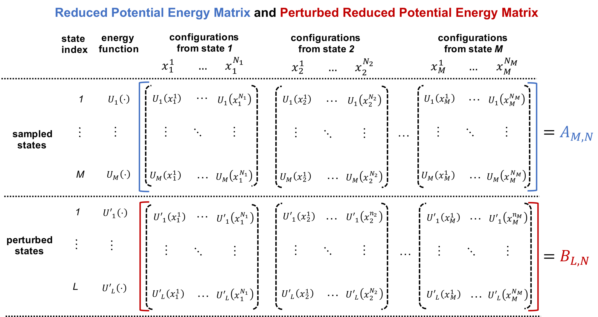

# Usage Guide

## 1. When to use the MBAR equations?

A common task in computational chemistry is to compute the relative free
energies of different thermodynamic states. Suppose there are \(M\) such states,
where the \(k\)-th state has a reduced potential energy function \(U_k(x)\) and
\(x\) denotes a system conformation. Conformations in the \(k\)-th state follow
the Boltzmann distribution \(p_k(x) \propto \exp\left(-U_k(x)\right)\), and the
reduced free energy of that state is
\(F_k = -\ln \int \exp\left(-U_k(x)\right)\, dx\).

!!! note "Reduced units"

    Both \(U_k(x)\) and \(F_k\) are **reduced** (unitless) quantities that absorb
    the inverse temperature \(\beta = 1 / k_b T\). If the original potential
    energy is \(E_k(x)\), then \(U_k(x) = \beta E_k(x)\). To recover a free energy
    in energy units, multiply the reduced free energy by \(k_b T\), i.e.,
    \(k_b T \, F_k\).

A widely used strategy to obtain the relative free energies of the \(M\) states
has two steps:

1. **Sample** conformations from each of the \(M\) states separately, using
   molecular dynamics or Monte Carlo simulations.
2. **Reweight** the sampled conformations from all states together to compute the
   relative free energies.

Let \(N_k\) be the number of conformations sampled from the \(k\)-th state in
step 1, denoted \(\{x^{n}_k, \; n = 1, \dots, N_k\}\) for \(k = 1, \dots, M\). The
MBAR equations carry out step 2: they reweight these conformations to estimate
the relative free energies \(F_k\) for \(k = 1, \dots, M\).

Once solved, the MBAR equations can also estimate the relative free energies of
**perturbed states** from which no conformations were sampled. If there are
\(L\) such states, the \(l\)-th perturbed state has its own reduced potential
energy function \(U^{\prime}_l(x)\).

This setup is quite general. It covers **alchemical free energy calculations** as
well as computing the potential of mean force (PMF) from **umbrella sampling** or
**temperature/Hamiltonian replica exchange** simulations.

## 2. How to use FastMBAR?

`FastMBAR` needs two inputs, both obtained from the sampling above:

- an energy matrix \(A\) of the reduced potential energies of the sampled
  conformations, and
- a vector \(v\) holding the number of conformations sampled from each state.

The matrix \(A\) has shape \(M \times N\), where \(M\) is the number of sampled
states and \(N = \sum_{k=1}^{M} N_k\) is the total number of conformations from
all states. Every conformation is evaluated in all \(M\) states, so each column
of \(A\) holds the \(M\) reduced energies of one conformation; that is,
\(A_{k,n}\) is the reduced potential energy of the \(n\)-th conformation
evaluated in the \(k\)-th state. The vector \(v = (N_1, N_2, \dots, N_M)\) records
how many conformations came from each state.

Putting these together, \(A\) is organized as shown below (blue), with its
columns grouped by the state each conformation was sampled from. The figure also
shows the perturbed energy matrix \(B\) (red), described in the next section.

<figure markdown="span">
  { width="100%" }
  <figcaption>
    The reduced potential energy matrix \(A\) (blue) of the sampled states and
    the perturbed reduced potential energy matrix \(B\) (red) of the perturbed
    states. Each column corresponds to one sampled conformation, evaluated in
    every state.
  </figcaption>
</figure>

Reading down a column gives the \(M\) reduced energies of one conformation;
reading across a row gives the energies of all \(N\) conformations evaluated in a
single state.

Both \(A\) and \(v\) must be
[NumPy arrays](https://numpy.org/devdocs/user/quickstart.html): \(A\) is
two-dimensional and \(v\) is one-dimensional. Given them, you create a `FastMBAR`
object, which solves the MBAR equations on construction:

```python
import numpy as np
from bayesmbar import FastMBAR

# construct the energy matrix A and the vector v
...

# initialize FastMBAR; the MBAR equations are solved here
fastmbar = FastMBAR(energy=A, num_conf=v, verbose=True)

# the relative free energies of the M states are stored in fastmbar.F
print(fastmbar.F)
```

!!! tip "GPU and TPU acceleration"

    `FastMBAR` is implemented with [JAX](https://jax.readthedocs.io/en/latest/)
    and automatically runs on a GPU or TPU when one is available and the matching
    JAX build is installed. No extra argument is needed to enable it.

To also estimate the uncertainty of the free energies, set `bootstrap=True`:

```python
import numpy as np
from bayesmbar import FastMBAR

# construct the energy matrix A and the vector v
...

# estimate uncertainties using block bootstrapping
fastmbar = FastMBAR(energy=A, num_conf=v, bootstrap=True, verbose=True)

# free energies and their standard deviations
print(fastmbar.F)
print(fastmbar.F_std)
```

!!! note "Column order matters with bootstrapping"

    When `bootstrap=True`, the conformations from each state must occupy a
    contiguous block of columns in \(A\), ordered by state: conformations from
    state \(k\) must come before those from state \(l\) whenever \(k < l\). When
    `bootstrap=False`, the column order does not matter.

### Free energies of perturbed states

The same `FastMBAR` object can estimate the relative free energies of perturbed
states from which no conformations were sampled. This requires one additional
input: a reduced potential energy matrix \(B\).

The matrix \(B\) has shape \(L \times N\), where \(L\) is the number of perturbed
states and \(N = \sum_{k=1}^{M} N_k\) is the same total number of conformations
sampled from the original \(M\) states. The entry \(B_{l,n}\) is the reduced
potential energy of the \(n\)-th conformation evaluated in the \(l\)-th perturbed
state. In other words, \(B\) has the same column layout as \(A\), but its rows
correspond to the \(L\) perturbed states. \(B\) is shown in red in the figure
above, alongside \(A\).

Pass \(B\) to the existing `FastMBAR` object to compute the perturbed-state free
energies:

```python
# compute the relative free energies of the perturbed states
results = fastmbar.calculate_free_energies_of_perturbed_states(B)

# free energies of the perturbed states
print(results["F"])

# their standard deviations
print(results["F_std"])
```

The returned dictionary also contains `DeltaF` and `DeltaF_std`, the pairwise
free energy differences between the perturbed states and their standard
deviations. See the [API reference](api.md) for details.
